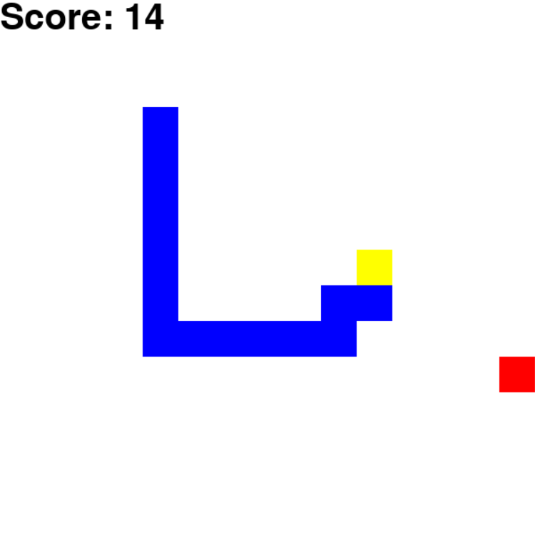

# RL_Snake

Play Gluttonous Snake game by reinforce learning.

## Dependence

* python lib: `pygame`, `numpy`, `matplotlib`.

  ​	Run commander follow to install:

  ```bash
  pip install pygame
  pip install numpy
  pip install matplotlib
  ```

  

## Quick Run

Use `view.py` to run game performed by a trained model:

```bash
python view.py
```



## Train

Use `train.py` to train model:

```bash
python train.py
```

You can use custom configuration to train by edit this file.
